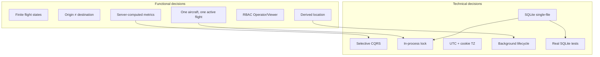
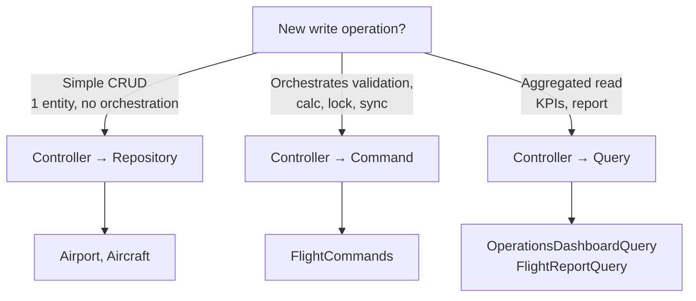
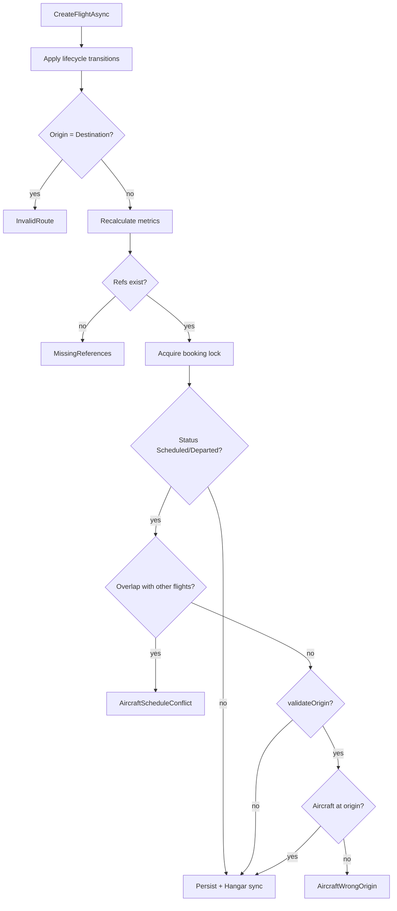

# FlightOps — Decision Map

Why the system works and is built this way — **functional** (product/business rules) and **technical** (architecture) decisions, linked to [ADRs](adr/README.md) and code.

**See also:** [Requirements](requirements.md) · [Navigation map](navigation-map.md)

---

## 1. Overview

---

## 2. Functional decisions

### FD-01 — Flight status model

| | |
|---|---|
| **Decision** | Four states: `Scheduled` → `Departed` → `Arrived`; `Scheduled` → `Cancelled` |
| **Why** | Covers scheduling, execution, completion, and no-show without a complex state machine |
| **Rejected alternative** | More states (boarding, taxi, holding) — overkill for demo/portfolio |
| **Code** | `Enums/FlightStatus.cs`, `FlightRepository.ApplyLifecycleTransitionsAsync` |
| **Effect** | `Scheduled` flight with `now ≥ ArrivalTime` becomes `Cancelled` automatically (missed flight) |

### FD-02 — Origin and destination must differ

| | |
|---|---|
| **Decision** | `OriginId != DestinationId` |
| **Why** | A flight with no displacement has no metrics or operational meaning |
| **Code** | `FlightCommands.CreateFlightAsync` → `InvalidRoute` |
| **UI** | Preview only fires when origin ≠ destination (`flight-create.js`) |

### FD-03 — No aircraft double-booking

| | |
|---|---|
| **Decision** | Two `Scheduled`/`Departed` flights for the same aircraft cannot have overlapping intervals |
| **Why** | An aircraft flies one itinerary at a time |
| **Rule** | `departureA < arrivalB && departureB < arrivalA` |
| **Code** | `FlightScheduleValidator` |
| **Message** | `Error.AircraftScheduleConflict` |

### FD-04 — Aircraft must be at origin (scheduled flights)

| | |
|---|---|
| **Decision** | When creating a `Scheduled` flight, the aircraft must be at the origin airport at departure time |
| **Why** | Prevents scheduling a departure from Lisbon with an aircraft in Porto |
| **Location resolution** | Last `Arrived` flight before departure → its destination; otherwise `Aircraft.CurrentAirportId` |
| **Code** | `AircraftLocationResolver`, `FlightScheduleValidator` |
| **Exception** | Create with `Departed` status — origin not validated (`validateOrigin: false`) because immediate dispatch assumes operator on site |

### FD-05 — Fleet location is derived, not editable in flight

| | |
|---|---|
| **Decision** | `CurrentAirportId = null` when in flight; on ground, synced with last arrived destination |
| **Why** | Single source of truth in flights; avoids manual vs reality divergence |
| **Code** | `HangarLocationSynchronizer`, edit rule in `AircraftController` |
| **UI** | Edit aircraft in flight blocks home/hangar changes |

### FD-06 — Flight metrics always recalculated on server

| | |
|---|---|
| **Decision** | Distance, Fuel, ArrivalTime computed in `FlightCommands` / preview query |
| **Why** | Client is not source of truth; prevents tampering |
| **Formulas** | Haversine + `FuelConsumptionPerKm` + `TakeOffEffort` + `CruiseSpeedKmh` |
| **Code** | `FlightCalculatorService` |

### FD-07 — Manual dispatch fixes departure time

| | |
|---|---|
| **Decision** | Transition to `Departed` (manual) → `DepartureTime = UtcNow` |
| **Why** | "Departed now" must reflect the real moment, not a past typed time |
| **Code** | `FlightCommands.ApplyManualDepartRules` |

### FD-08 — RBAC with two roles

| | |
|---|---|
| **Decision** | `Operator` (write) vs `Viewer` (read) |
| **Why** | Demonstrate real authorization without a complex permission matrix |
| **Defense** | Server policy + UI that hides actions |
| **Code** | `Program.cs` policies, `[Authorize]` on controllers |

### FD-09 — Delete with referential integrity

| | |
|---|---|
| **Decision** | Do not delete airport/aircraft referenced by flights |
| **Why** | Flight history must remain consistent |
| **Code** | FK `OnDelete(Restrict)` in `FlightOpsDbContext` |

### FD-10 — Unique operational identifiers

| | |
|---|---|
| **Decision** | Unique IATA per airport; unique Registration per aircraft |
| **Why** | Real aviation identifiers are globally unique within the app scope |
| **Code** | EF unique indexes + `DbUniqueViolationDetector` |

---

## 3. Technical decisions (with ADR)

| ID | Decision | Why X over Y | ADR | Key code |
|----|----------|--------------|-----|----------|
| TD-01 | SQLite in production (Azure) | **X:** zero extra cost, persistent file in `/home` · **Y:** Azure SQL — over-provisioning for demo | [001](adr/001-sqlite-azure-app-service.md) | `Program.cs`, `appsettings.json` |
| TD-02 | In-process lock per aircraft | **X:** fixes TOCTOU validate-then-save · **Y:** validation only — race on parallel requests | [002](adr/002-in-process-booking-lock.md) | `AircraftBookingLock.cs` |
| TD-03 | CQRS only for Flights | **X:** flights orchestrate validation+calc+lock+sync · **Y:** commands everywhere — boilerplate on simple CRUD | [003](adr/003-selective-cqrs.md) | `Features/Flights/Commands/` vs direct controllers |
| TD-04 | Real SQLite tests | **X:** supports `ExecuteUpdateAsync` · **Y:** EF InMemory — green tests, broken prod | [004](adr/004-sqlite-integration-tests.md) | `FlightOps.Tests/` |
| TD-05 | UTC + browser offset | **X:** correct cross-timezone times · **Y:** server-local (ADR-005 superseded) | [005](adr/005-server-local-time.md) superseded | `FlightTimeConverter`, `fo_tz_offset` cookie |
| TD-06 | Single instance | **X:** SQLite file + lock are process-local · **Y:** scale-out — needs shared DB + distributed lock | [006](adr/006-single-instance-deployment.md) | Azure deploy, `docker-compose` |
| TD-07 | No audit/RowVersion (for now) | **X:** faster delivery · **Y:** full audit — planned; RowVersion will replace lock | [007](adr/007-defer-audit-and-rowversion.md) | Entities without `IAuditable` |

---

## 4. Decision tree: where to put logic

**Concrete examples:**

| Operation | Path | Reason |
|-----------|------|--------|
| Create airport | `AirportController` → `AirportRepository` | 1 entity, 1 unique validation |
| Create flight | `FlightController` → `IFlightCommands` | 5+ chained steps |
| Dashboard | `HomeController` → `IOperationsDashboardQuery` | Read-only aggregation |

---

## 5. Decision tree: flight validation

---

## 6. UX / product decisions

| Decision | Choice | Alternative | Rationale |
|----------|--------|-------------|-----------|
| Flight preview | Debounced AJAX on create | Show only after save | Operator sees impact before commit |
| 3D simulation | CesiumJS + poll | SignalR push | Simplicity; demo doesn't need real-time infra |
| Dashboard as home | `/` = operations centre | Flight list | "Operations centre" narrative |
| i18n | 3 locales RESX | EN only | Portfolio shows ASP.NET Core localization |
| Demo seed | 30+ airports, 41 aircraft | Empty DB | Immediate experience after clone |
| Secure by default | FallbackPolicy authenticated | Opt-in `[Authorize]` | Lower risk of forgotten endpoints |

---

## 7. Conscious technical debt

| Item | Current state | Future direction | ADR |
|------|---------------|------------------|-----|
| Booking concurrency | `SemaphoreSlim` in-process | `RowVersion` on `Aircraft` | 007 |
| Audit | Request logs only | `IAuditable` + `CreatedBy` | 007 |
| Scale-out | Not allowed | Migrate to PostgreSQL/SQL Server + distributed lock | 001, 006 |
| Timezone | Cookie offset | Per-user `TimeZoneInfo` if needed | 005 superseded |

---

## 8. Cross-reference: requirement → decision → implementation

| Requirement | Decision | File(s) |
|-------------|----------|---------|
| RF-FLT-04 schedule conflict | FD-03 | `FlightScheduleValidator.cs` |
| RF-FLT-04 correct origin | FD-04 | `AircraftLocationResolver.cs` |
| RF-AC-05 hangar sync | FD-05 | `HangarLocationSynchronizer.cs` |
| RF-FLT-06 lifecycle | FD-01 | `FlightRepository.cs`, `FlightLifecycleBackgroundService.cs` |
| RF-FLT-08 concurrency | TD-02 | `AircraftBookingLock.cs` |
| RF-AUTH-02 roles | FD-08 | `IdentitySeeder.cs`, `Program.cs` |
| Simple airport CRUD | TD-03 | `AirportController.cs` |
| NFR-01 SQLite prod | TD-01 | `Dockerfile`, Azure workflow |

---

## 9. How to use this map

1. **New contributor** — read FD-01 through FD-06 before changing flight rules
2. **Code review** — any lock/lifecycle change must cross-check ADR-002, ADR-006, ADR-007
3. **New endpoint** — follow section 4 tree (Controller → Repo vs Command vs Query)
4. **Product** — add a row in [requirements.md](requirements.md) and, if architectural, a new numbered ADR
