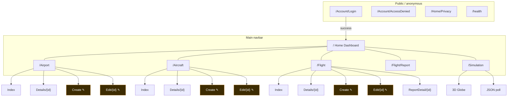
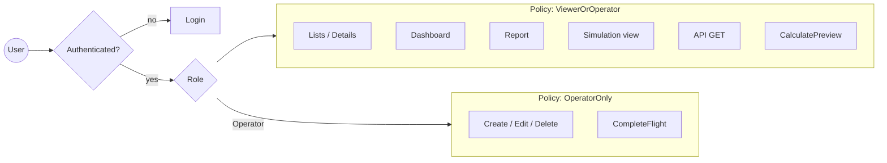
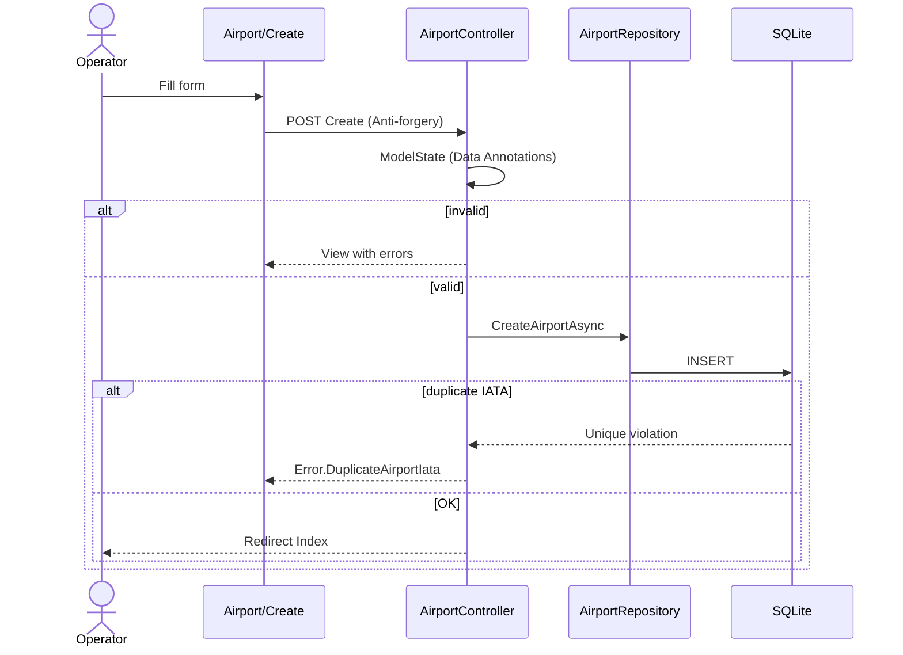
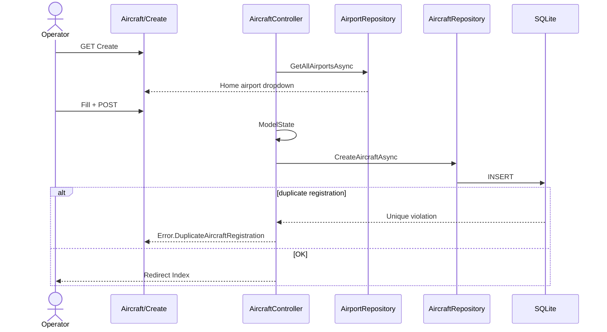
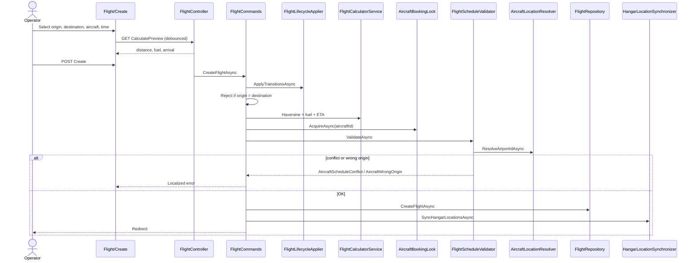
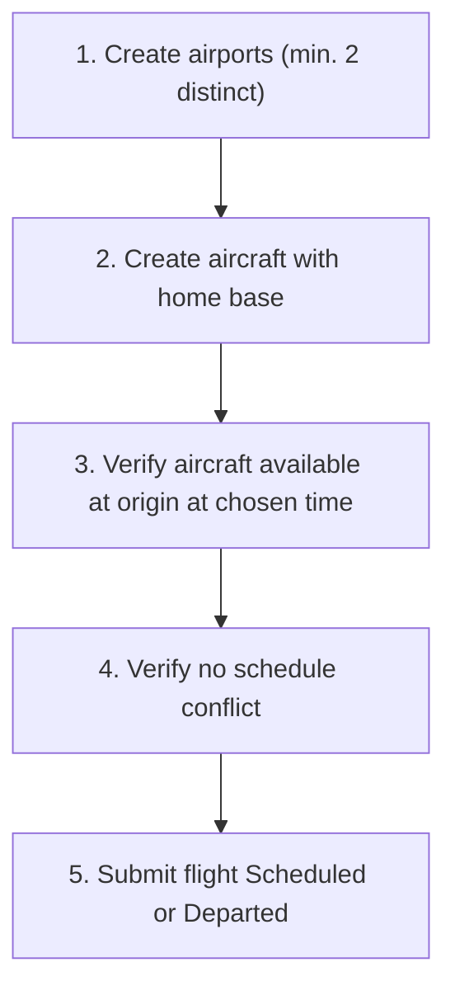
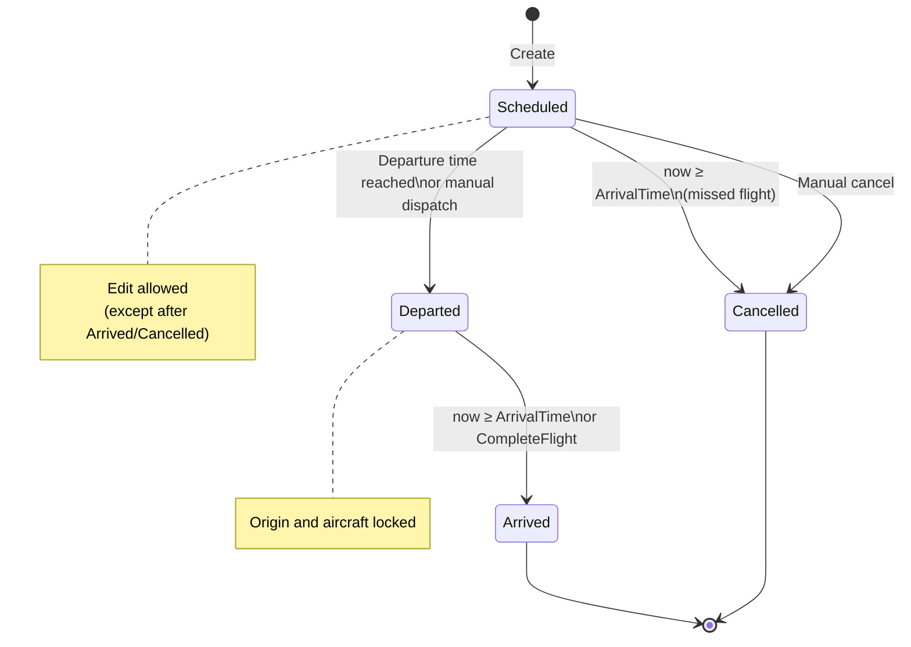
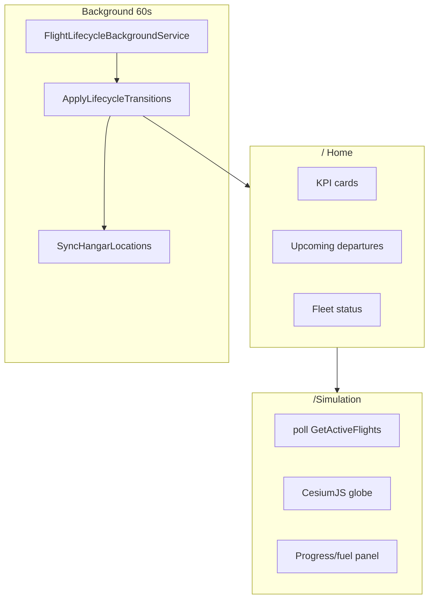
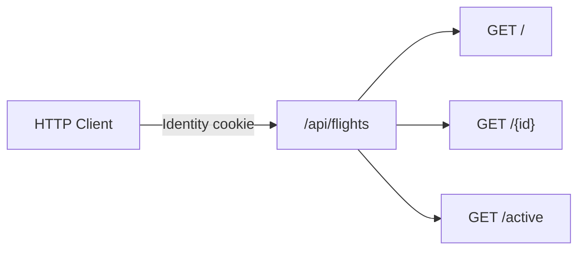

# FlightOps — Navigation Map

Routes, user flows, and diagrams derived from the current codebase.

**See also:** [Requirements](requirements.md) · [Decision map](decisions-map.md) · [API](api.md)

---

## 1. Site map (authenticated)

**Legend:** routes marked **✎** require the `Operator` role.

---

## 2. Authorization by area

| Controller | GET read | POST write |
|------------|----------|------------|
| `HomeController` | Authenticated | — |
| `AccountController` | Anonymous (login) | Logout authenticated |
| `AirportController` | ViewerOrOperator | OperatorOnly |
| `AircraftController` | ViewerOrOperator | OperatorOnly |
| `FlightController` | ViewerOrOperator | OperatorOnly |
| `SimulationController` | ViewerOrOperator | CompleteFlight: OperatorOnly |
| `FlightsApiController` | ViewerOrOperator | — |

---

## 3. Flow: create airport

**Prerequisites:** none.

**Fields:** Name, City, Country, IATA (3 chars), Latitude, Longitude.

---

## 4. Flow: create aircraft

**Prerequisites:**

1. ≥ 1 airport (for `CurrentAirportId`)
2. Operator role

**Required fields:** Registration, Name, Model, Home airport, TakeOffEffort ≥ 1, FuelConsumptionPerKm > 0, CruiseSpeedKmh > 0.

---

## 5. Flow: create flight

**Prerequisites (recommended order):**

**Allowed statuses on create:** `Scheduled`, `Departed`.

**Server-computed fields:** Distance, Fuel, ArrivalTime (do not trust the client).

---

## 6. Flight lifecycle

---

## 7. Simulation and monitoring

---

## 8. REST API

Interactive docs: `/swagger` (Development only). See [api.md](api.md).

---

## 9. Navbar utilities

| Element | Route / action |
|---------|----------------|
| UTC clock | `_NavbarUtils` |
| Language | `GET /Home/SetCulture?culture=&returnUrl=` |
| Login / Logout | `/Account/Login`, `POST /Account/Logout` |

Valid cultures: `en`, `pt-PT`, `de-DE`.

---

## 10. Typical operational onboarding order

1. Log in as `operator@flightops.demo`
2. Review seeded airports at `/Airport`
3. Review fleet at `/Aircraft` (or create new with home base)
4. Create flight at `/Flight/Create` — use preview before submit
5. Monitor at `/` (dashboard) or `/Simulation`
6. History at `/Flight/Report`

For external integration: consume `GET /api/flights/active` with an authenticated session.
