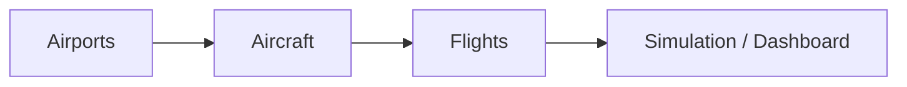

# FlightOps — Functional Requirements

Derived from **implemented** behaviour in the codebase. Serves as a product contract for operators, reviewers, and new contributors.

**See also:** [Navigation map](navigation-map.md) · [Decision map](decisions-map.md) · [ADRs](adr/README.md)

---

## 1. Overview

FlightOps simulates an airline operations centre. Authenticated users manage airports, fleet, and flights; the system calculates distance/fuel/arrival, applies status transitions automatically, and displays active flights on a 3D globe.

### Actors

| Actor | Description |
|-------|-------------|
| **Operator** | Full CRUD + manual dispatch + complete flight in simulation |
| **Viewer** | Read-only access to lists, details, dashboard, report, simulation, and API |
| **System** | Lifecycle background service, hangar sync, automatic calculations |

### Data dependency chain

| Entity | Prerequisites | Blocks |
|--------|---------------|--------|
| Airport | None | Aircraft (home airport), Flights (origin/destination) |
| Aircraft | ≥ 1 airport for home base | Flights |
| Flight | Existing airports + aircraft | — |

On first run, `DbSeeder` populates sample airports, fleet, and flights if the database is empty.

---

## 2. Authentication and authorization

### RF-AUTH-01 — Login required

Every MVC and API route requires an authenticated user, except login, access denied, privacy, error, culture switch, and `/health`.

**Implementation:** `FallbackPolicy` in `Program.cs`.

### RF-AUTH-02 — Roles

| Role | Permissions |
|------|-------------|
| `Operator` | Read + write (Create/Edit/Delete, dispatch, `CompleteFlight`) |
| `Viewer` | Read-only |

### RF-AUTH-03 — Demo accounts

| Email | Password | Role |
|-------|----------|------|
| `operator@flightops.demo` | `Operator123!` | Operator |
| `viewer@flightops.demo` | `Viewer123!` | Viewer |

Created at startup by `IdentitySeeder` if missing.

### RF-AUTH-04 — Defense in depth

The UI hides write actions for Viewers; the server rejects with `AccessDenied` even if the client is bypassed (covered by E2E).

---

## 3. Airports

### RF-APT-01 — List and view

- `GET /Airport/Index` — searchable paginated list
- `GET /Airport/Details/{id}` — detail with recent flights
- Role: `ViewerOrOperator`

### RF-APT-02 — Create airport

**Route:** `GET/POST /Airport/Create` · Role: `OperatorOnly`

| Field | Required | Rule |
|-------|----------|------|
| Name | Yes | `[Required]` |
| City | Yes | `[Required]` |
| Country | Yes | `[Required]` |
| IATA | Yes | Exactly 3 characters, unique in DB |
| Latitude | Yes | `[Required]` |
| Longitude | Yes | `[Required]` |

**Server validations:**

| Code | Condition | i18n message |
|------|-----------|--------------|
| Unique IATA | Unique index on `Airport.IATA` | `Error.DuplicateAirportIata` |

**Technical flow:** `AirportController` → `AirportRepository` (no command layer — see ADR-003).

### RF-APT-03 — Edit and delete

- Edit: same fields and validations as create
- Delete: blocked if flights reference the airport (`DeleteBehavior.Restrict`) → `Error.DeleteAirportReferenced`

### RF-APT-04 — Prerequisites

None. Airports are root entities.

---

## 4. Aircraft

### RF-AC-01 — List and view

- `GET /Aircraft/Index`, `GET /Aircraft/Details/{id}`
- Detail includes flight history via `AircraftDetailsQuery`
- Role: `ViewerOrOperator`

### RF-AC-02 — Create aircraft

**Route:** `GET/POST /Aircraft/Create` · Role: `OperatorOnly`

| Field | Required | Rule |
|-------|----------|------|
| Registration | Yes | Unique in DB |
| Name | Yes | — |
| Model | Yes | — |
| CurrentAirportId (Home) | Yes | `Range(1, int.MaxValue)` — airport must exist |
| HangarBay | No | e.g. `T1-H12` |
| TakeOffEffort | Yes | Integer ≥ 1 (take-off fuel) |
| FuelConsumptionPerKm | Yes | > 0 |
| CruiseSpeedKmh | Yes | > 0 |

**Server validations:**

| Code | Condition | i18n message |
|------|-----------|--------------|
| Unique registration | Unique index on `Aircraft.Registration` | `Error.DuplicateAircraftRegistration` |

**Functional prerequisite:** At least one airport in the DB to populate the home-base dropdown.

### RF-AC-03 — Edit aircraft

Additional rules when the aircraft is **in flight** (`CurrentAirportId == null`):

- Home airport **cannot be changed** (value preserved from DB)
- Hangar bay **cannot be changed**

Reason: in-flight location is derived from flight state, not manually editable.

### RF-AC-04 — Delete aircraft

Blocked if flights reference the aircraft → `Error.DeleteAircraftReferenced`.

### RF-AC-05 — Fleet location (hangar sync)

After creating/updating flights or lifecycle transitions, `HangarLocationSynchronizer`:

1. In-flight aircraft (`Departed`, `DepartureTime ≤ now < ArrivalTime`) → `CurrentAirportId = null`
2. On-ground aircraft → `CurrentAirportId` = destination of last `Arrived` flight with `ArrivalTime ≤ now`

---

## 5. Flights

### RF-FLT-01 — List, report, and detail

| Route | Purpose |
|-------|---------|
| `/Flight/Index` | List with status filters |
| `/Flight/Report` | Paginated report with totals |
| `/Flight/Details/{id}` | Flight detail |
| `/Flight/ReportDetail/{id}` | Detail in report context |

Role: `ViewerOrOperator`.

### RF-FLT-02 — Create flight

**Route:** `GET/POST /Flight/Create` · Role: `OperatorOnly`

| Field | Required | Notes |
|-------|----------|-------|
| OriginId | Yes | Origin airport |
| DestinationId | Yes | Must be ≠ origin |
| AircraftId | Yes | Existing aircraft |
| DepartureTime | Yes | `datetime-local`; converted to UTC in controller |
| Status | Yes | Create: `Scheduled` or `Departed` |
| Distance, Fuel, ArrivalTime | Computed | Server via `FlightCalculatorService` |

**Live preview:** `GET /Flight/CalculatePreview` — JSON with distance, fuel, and estimated arrival (client debounce via `flight-create.js`).

### RF-FLT-03 — Metric calculation

`FlightCalculatorService`:

- Distance: Haversine formula between airport coordinates
- Fuel: `distance × FuelConsumptionPerKm + TakeOffEffort`
- Arrival: `DepartureTime + (distance / CruiseSpeedKmh)`

### RF-FLT-04 — Business validations (create/update)

Orchestrated by `FlightCommands` + `FlightScheduleValidator`:

| Code | Condition | When applies |
|------|-----------|--------------|
| `InvalidRoute` | `OriginId == DestinationId` | Create/update |
| `MissingReferences` | Airport or aircraft does not exist | Create/update |
| `AircraftScheduleConflict` | Overlapping time intervals for same aircraft | Status `Scheduled` or `Departed` |
| `AircraftWrongOrigin` | Aircraft not at origin airport at departure time | Create if `Scheduled`; update per rule |
| `InvalidStatusTransition` | Disallowed status transition | Update |

**Overlap:** two flights conflict if `departureA < arrivalB && departureB < arrivalA` against other `Scheduled`/`Departed` flights for the same aircraft.

**Correct origin:** `AircraftLocationResolver` — last `Arrived` flight before departure → its destination; otherwise `Aircraft.CurrentAirportId`.

### RF-FLT-05 — Manual dispatch

When creating or changing to `Departed` from `Scheduled`:

- `DepartureTime` is forced to `UtcNow` (`ApplyManualDepartRules`)

### RF-FLT-06 — Automatic lifecycle

`FlightLifecycleBackgroundService` (60 s) + `FlightLifecycleApplier` on each mutation:

| From | Condition (UTC) | To |
|------|-----------------|-----|
| `Scheduled` | `now ≥ ArrivalTime` | `Cancelled` (missed flight) |
| `Scheduled` | `DepartureTime ≤ now < ArrivalTime` | `Departed` |
| `Departed` | `now ≥ ArrivalTime` | `Arrived` |

### RF-FLT-07 — Edit rules

| Current status | Allowed |
|----------------|---------|
| `Arrived`, `Cancelled` | No edits |
| `Departed` | Cannot change origin, aircraft, or revert to `Scheduled` |
| `Scheduled` | → `Departed` or `Cancelled`; other fields editable |

### RF-FLT-08 — Booking concurrency

`AircraftBookingLock` — in-process semaphore per `aircraftId` serializes validate-then-save (ADR-002). Prevents TOCTOU double-booking on a single instance.

### RF-FLT-09 — Prerequisites

1. At least 2 distinct airports (origin ≠ destination)
2. At least 1 aircraft
3. For `Scheduled` flights: aircraft must be physically at origin at departure time
4. Aircraft cannot have another `Scheduled`/`Departed` flight with overlapping interval

---

## 6. Simulation

### RF-SIM-01 — 3D globe

- `GET /Simulation` — CesiumJS with active `Departed` flights
- JSON poll: `GetActiveFlights`, `GetFlight/{id}`
- Read role: `ViewerOrOperator`

### RF-SIM-02 — Manually complete flight

- `POST /Simulation/CompleteFlight/{id}` — force arrival
- Role: `OperatorOnly`

Position interpolation: `GeoInterpolationService` along the great-circle arc.

---

## 7. Dashboard and API

### RF-DASH-01 — Operations dashboard

`GET /` — KPIs (active flights, ground/airborne fleet, upcoming departures, today's cancellations), departure list, and fleet status.

### RF-API-01 — REST read-only

| Endpoint | Description |
|----------|-------------|
| `GET /api/flights` | Flight list |
| `GET /api/flights/{id}` | Detail |
| `GET /api/flights/active` | In-progress `Departed` flights |

Role: `ViewerOrOperator`. Swagger in Development only.

---

## 8. Internationalization and time

### RF-I18N-01

Supported cultures: `en`, `pt-PT`, `de-DE`. Strings in `Resources/SharedResources*.resx`.

### RF-TIME-01

- **UTC** persistence on the server
- Browser timezone display via `fo_tz_offset` cookie and `FlightTimeConverter`
- ADR-005 (server-local only) is **superseded** by this approach

---

## 9. Validation matrix (summary)

| Domain | Type | Mechanism |
|--------|------|-----------|
| Form fields | Client + server | Data Annotations + Unobtrusive Validation |
| Unique IATA | Server | DB index + `DbUniqueViolationDetector` |
| Unique registration | Server | DB index + detector |
| Invalid route | Server | `FlightCommands` |
| Schedule conflict | Server | `FlightScheduleValidator` |
| Wrong origin | Server | `AircraftLocationResolver` |
| Status transition | Server | `FlightCommands.IsStatusTransitionAllowed` |
| FK delete | Server | `DeleteBehavior.Restrict` |
| Concurrent booking | Server | `AircraftBookingLock` (single instance) |

---

## 10. Non-functional requirements

| ID | Requirement | Decision |
|----|-------------|----------|
| NFR-01 | Database | SQLite (dev + Azure prod) — ADR-001 |
| NFR-02 | Deploy | Single instance — ADR-006 |
| NFR-03 | Integration tests | Real SQLite in-memory — ADR-004 |
| NFR-04 | Health | `GET /health` with EF check |
| NFR-05 | Observability | Request logging with correlation ID |
| NFR-06 | CI | GitHub Actions: tests before deploy |
| NFR-07 | Audit | Deferred — ADR-007 |

---

## 11. Consciously out of scope

- Multi-instance / scale-out without migrating DB and lock
- Public user registration (seed accounts only)
- Optimistic concurrency (`RowVersion`) — planned in ADR-007
- Audit trail (`CreatedAt`, `CreatedBy`) — planned in ADR-007
- Azure SQL / PostgreSQL in production
